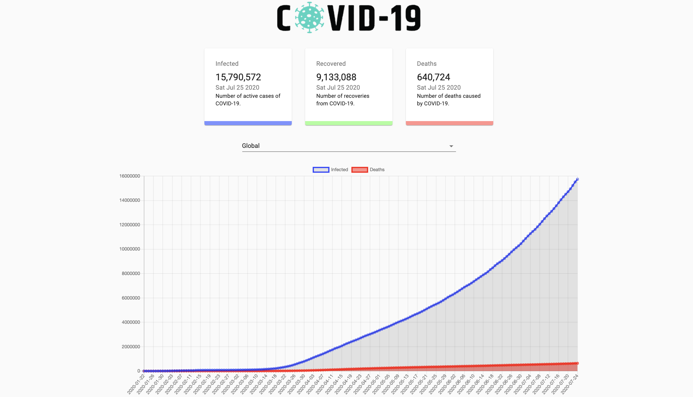
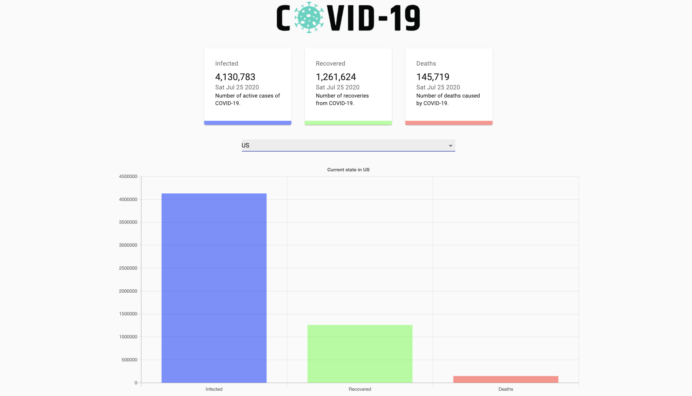

An API-derived React app providing up to date numbers of infected, recovered, and dead of COVID-19, globally and by country.

### Prerequisites

- [Node](https://nodejs.org/) - Node Package Manager

## Getting Started

To use this software, either clone or download and extract the files to a location of your choosing on your computer. To clone the repository, copy the clone link, open a terminal window and enter "git clone https://github.com/seanhellier/covid-trak.git"

After establishing the repository on your computer, open a terminal and enter "npm install" to install dependencies.

Run the software by entering "npm start" in a terminal window.

git clone https://github.com/seanhellier/covid-trak.git

cd covid-trak
npm install
npm start

open http://localhost:3000/ in a browser

### Use

to use the application, choose the country one wishes to see the current numbers of infected, recovered, and deaths from the drop down or choose "Global" to see the world totals.

## Built With

- [Elemental-UI](http://elemental-ui.com/) - The CSS framework used for the skin
- [Javascript](https://www.javascript.com/) - Used for functionality
- [React](https://reactjs.org/) - Used for functionality
-

## Contributing

Please read [CONTRIBUTING.md](https://github.com/seanhellier/covid-trak/blob/master/contributing.md) for details on my code of conduct, and the process for submitting pull requests.

## Versioning

[SemVer](http://semver.org/) for versioning. For the versions available, see the [tags on this repository](https://github.com/your/project/tags).

## Authors

- **Sean Leif Hellier** - _Initial work:_
  _ [Website](http://www.seanhellier.com)
  _ [Github](https://github.com/seanhellier/slh_portfolio)

## License

This project is licensed under the MIT License - see the [LICENSE.md](LICENSE.md) file for details

## Deployment

[Heroku](https://covid-trak.herokuapp.com/)
[Github](https://github.com/seanhellier/covid-trak)
